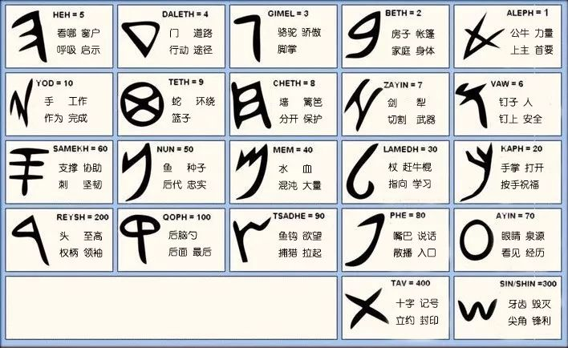
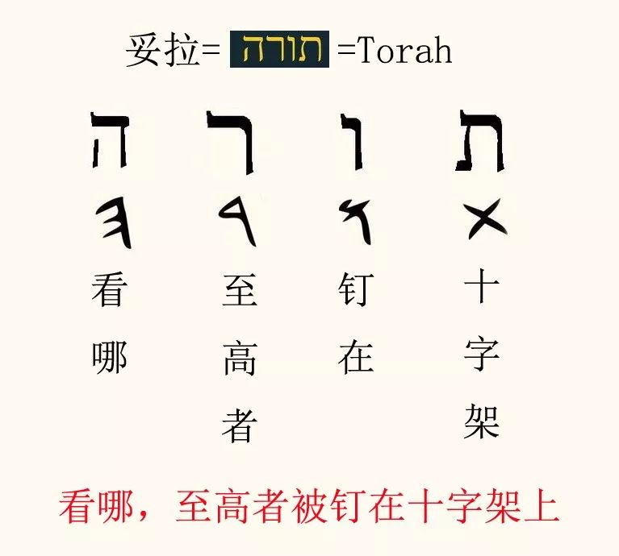
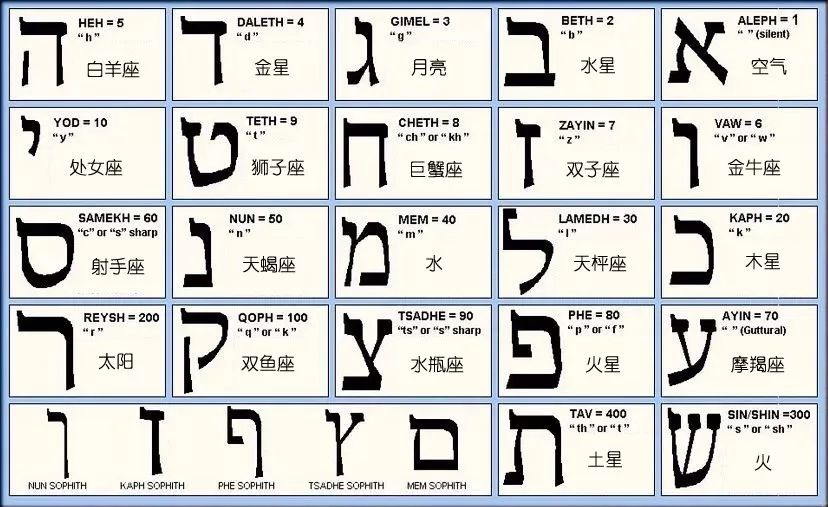
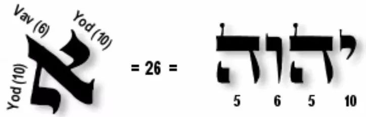

# 希伯来字母

---

《教训的火炬》事工的圣经学习是建立在希伯来根源之上，对学习者而言，需要先熟悉一些基本概念。所以做了这个圣经学习基础系列，将圣经学习所需的基础概念作个简单说明。

## 为什么称"学习妥拉"而不是"读圣经"

我们之所以把圣经学习称之为学习妥拉（תורה），是为了区别于建立在圣经翻译本（比如和合本）的基础上所做出的解经和学习。翻译者的文化、神学观念和历史背景，以及不同语言间的差异，会给解经造成很大的影响。

比如"妥拉"这个词，你当然可以翻译为圣经、律法等等，但其实无论哪个中文词都无法完全表达原文"תורה"的含义。而基于传统的神学观点，妥拉总是被翻译为律法，并且人为赋予了一个负面的意义，似乎新约就是要反律法、恩典就要反对律法。而从原文来看，妥拉一词的字根是"射中靶心"的意思，引申为教导和训诲。妥拉是天父赐给祂孩子的指示和教训，培养和训练孩子长大成人。תורה 同样是神的恩典。天父是昨日、今日、直到永远都不改变的。

教训的火炬的妥拉学习致力于从圣经原文出发，扎根于希伯来传统，力求还原经文本来的意思。妥拉是用希伯来语写成，要深入地学习和理解妥拉，至少需要对希伯来语有些基础性的认识。

## 希伯来字母是象形字母

希伯来语共有 **22 个字母**，由此组成千千万万的单词。犹太人认为，神就是用这 22 个字母创造了世界。

希伯来字母是象形字母，每个字母都对应一定的象形含义——这对于理解和认识经文的词、句是非常必要的知识。下面是希伯来字母的古体和对应的象形含义：

*↑ 希伯来字母古体与象形含义对照*

而这些象形文字使得每个希伯来词中都隐藏了神的奥秘。比如"妥拉"这个词，当我们把组成妥拉的四个字母的象形义加入后，会看到耶稣钉十架的奥秘早就隐藏在妥拉中：

*↑ "妥拉"（תורה）一词四个字母的象形寓意*

## 字母对应数字：数字解经（Gematria）

希伯来字母的另一个特点，是每个希伯来字母都对应一个相应的数字。比如 א 是 1，י 是 10。

妥拉学习的另一个重要解经手段就是**数字解经（Gematria）**。将每个希伯来词语的所有字母的数字，或相加、或相乘、或求平方、或求三角数等等——字母有不同组合，所对应的数字也有多种算法，因此数字解经也是无止境的。

> ⚠️ 数字解经属于奥秘层的解经。无论怎么进行数字解经，都不能偏离经文的字面意思（**奥秘层不能废掉简单层**）。

下面是希伯来字母、对应数值和字母属性：

*↑ 希伯来字母、对应数值与字母属性对照*

## 举例说明

再举一个简单例子说明：

*↑ 耶和华（יהוה）四个字母数值相加 = 26*

**יהוה** 中文翻译为耶和华，是上帝告诉摩西的名字，由四个希伯来字母组成，相加是 26。**所以 26 就是耶和华的数字。**

再看《启示录》13 章提到的"兽名的数目"——经文说可以算计兽的数目，外邦教会为此争论不休。其实如果你明白这个基础知识，就知道：它指的是将来那个行毁坏可憎之事的大罪人，他的名字用希伯来语书写（兽一定是犹太人，因为他假冒弥赛亚，而犹太人不会相信一个非犹太人的弥赛亚）后，计算出的数目是 **666**。
